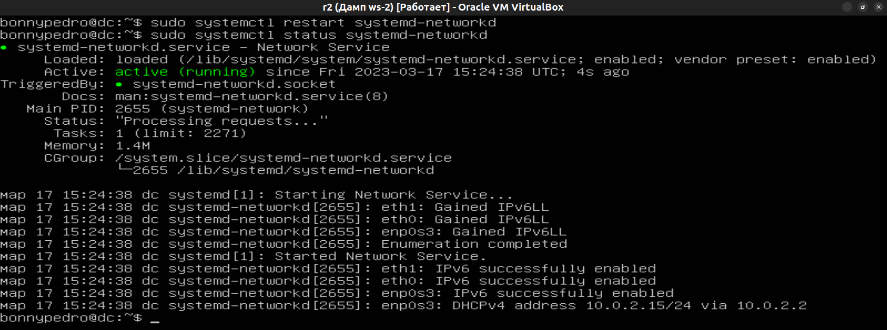
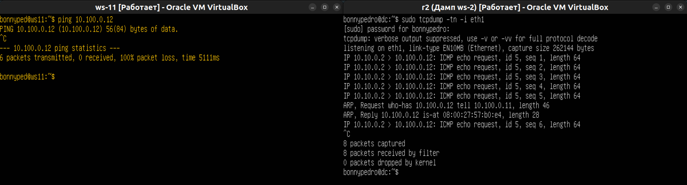

- [Part 1. Инструмент **ipcalc**](#part-1-инструмент-ipcalc)
- [Part 2. Статическая маршрутизация между двумя машинами](#part-2-статическая-маршрутизация-между-двумя-машинами)
- [Part 3. Утилита **iperf3**](#part-3-утилита-iperf3)
- [Part 4. Сетевой экран](#part-4-сетевой-экран)
- [Part 5. Статическая маршрутизация сети](#part-5-статическая-маршрутизация-сети)
- [Part 6. Динамическая настройка IP с помощью DHCP](#part-6-динамическая-настройка-ip-с-помощью-dhcp)
- [Part 7. NAT](#part-7-nat)

## Part 1. Инструмент **ipcalc**
___
    1.1 Сети и маски
1. адрес сети *192.167.38.54/13*, определить адрес сети по IP адресу и маске подсети можно при помощи вызова команды
   
    `ipcalc 192.167.38.54/13`

    получим такой вывод программы:
   
    

   чтобы получить в выводе только необходимый адрес сети, использую команду

    `ipcalc 192.167.38.54/13 | grep Network`

    результат:

    

   + следовательно адрес сети 
    ```
    192.160.0.0
    ```

2. перевод маски 
   + **"255.255.255.0"**  перевожу в префиксный и двоичный форматы
    команда:

    `ipcalc 255.255.255.0 | grep Netmask`

    вывод:

    

    ответ - префиксная запись макси подсети: 
    ```
    /24
    ```
    ответ - двоичная запись маски подсети: 
     ```
    11111111.11111111.11111111. 00000000
     ```

    + **"/15"**   перевожу в обычный и двоичный формат
    команда:

    `ipcalc /15`

    вывод:

    

    т.к. перевод осуществляется в нормализованный вид из префиксного, результат смотрим в строчке Address
    ответ - десятичная форма записи:

    ```
    255.254.0.0
    ```

    ответ - двоичная запись маски подсети:

    ```
    11111111.11111110.00000000. 00000000
    ``` 

    + **11111111.11111111.11111111.11110000**   перевожу в обычный формат и префиксный

    т.к. утилите ipcalc нельзя подать формат двоичного вида ip адреса, нужно вручную перевести в десятичный вид
    ответ:

    ```
    255.255.255.240
    ```
    далее, чтобы получить префиксную запись, необходимо воспользоваться таблицей записи масок подсети

    

    ответ: 

    ```
    /28
    ```

    проверяем:

     `ipcalc /28`

    вывод:

    

    все сходится:)

3. определяю минимальный и максимальный хост в сети **12.167.38.4**
   + маска **/8**
    команда:
    
    ```
    ipcalc 12.167.38.4/8 | grep -P 'Min|Max'
    ```

    вывод и по совместительству правильный ответ:

    

   + маска **11111111.11111111.00000000.00000000** == маске подсети в десятичном виде 255.255.0.0 == /16  (согласно таблице)
    команда:
    
    ```
    ipcalc 12.167.38.4/16 | grep -P 'Min|Max'
    ```
   
    вывод и по совместительству правильный ответ:

    

   + маска **255.255.254.0** == /23  (согласно таблице)
    команда:
    
    ```
    ipcalc 12.167.38.4/23 | grep -P 'Min|Max'
    ```
   
   вывод и по совместительству правильный ответ:

    
   
   
   + маска **/4**
    команда:
    
    ```
    ipcalc 12.167.38.4/4 | grep -P 'Min|Max'
    ```

   вывод и по совместительству правильный ответ:

    


        1.2. localhost
    
    Можно обратиться к приложениям работающим на адресах lo с адресацией от 127.0.0.1 до 127.255.255.254

    

    Приложения к которым можно обратиться по адресам вне вышеуказнного диапозона работают вне localhost

    


        1.3 Дапазоны и сегменты сетей

    1. Определяю ip адрес для частных и публичных сетей:
      + частные:
    ```
    10.0.0.45
    192.168.4.2
    172.20.250.4
    172.16.255.255
    10.10.10.10
    ```
      + публичные:
    ```
    134.43.0.2
    172.0.2.1
    192.172.0.1
    172.68.0.2
    192.169.168.1
    ```
   2. IP адреса шлюза у сети **10.10.0.0/18** возможны:
    ```
    10.10.0.2
    10.10.10.10
    10.10.1.255
    ```

    IP адреса шлюза у сети **10.10.0.0/18** невозможны:
    
    ```
    10.0.0.1
    10.10.100.1
    ```


## Part 2. Статическая маршрутизация между двумя машинами
___

+ Сетевые интерфесы:
  
    ws-1:
    

    ws-2:
    

+ перенастроил **etc/netplan/00-installer-config.yaml**
  
    ws-1
    

    ws-2
    

+ применяем настройки  `sudo netplan apply`

    ws-1
    

    ws-2
    
    
+ добавляю статический маршрут вручнуюего можно добавить двумя способами, указав непосредственно IP адрес, чечрез который осуществляется содинение или сетевой маршрут
  
    ws-1 и ws-2
    

+ добавляю статический маршрут через файл *etc/netplan/00-installer-config.yaml*

    ws-1 и ws-2 содержание файлов *.yaml
    

+ ping хостов
  
    ws-1 и ws-2
    


## Part 3. Утилита **iperf3**
  ___
  3.1 Скорость соединения
    
   + 8 Mbps == 1 MB/s
   + 100 MB/s == 819 200 Kbps
   + 1 Gbps == 1024 Mbps
   + замер скорости
  
   

   

## Part 4. Сетевой экран
  ___

  4.1. Утилита **iptables**
  ___
  + Содержание файла */etc/firewall* в ws-1 и в ws-2
  ___
    

  + Запуск файлов */etc/firewall.sh* ws-1, ws-2
   ___
    

  + Разница между стратегиями заключается в том, что после запрещающего правила на *echo reply* разрешающее правило не срабатывает, т.е. происходит остановка прохода по правилам по направлению, в случае разрешающего правила, происходит переход к следующему правилу и судя по всему это позволит добавлять дополнительные фидьтры.
  
  ___
    4.2. Утилита **nmap**

  + Скрин с использованием команд **ping** и **nmap**

  ___
    

## Part 5. Статическая маршрутизация сети
5.1 Настройка адресов машин
___
 + настроил *etc/netplan/00-installer-config.yaml согласно сети на рисунке*
  
  скрин этого файла с машин r1 & r2
  ___
   


  скрин этого файла с машин ws21 & ws22
  ___
    
   

  скрин этого файла с машины ws11
  ___
    
   

   + перезапуск сервиса сети 

  скрин с машин ws11 & r1
  ___
   


  скрин с машин ws21 & ws22
  ___
    
   

  скрин с машины r2
  ___
    
   

   + и вызов команды ip -4 a
   скрин с машин ws11 & r1
  ___
   


  скрин с машин ws21 & ws22
  ___
    
   

  скрин с машины r2
  ___
    
   

5.2 Включение переадресации IP-адресов
    
  + скрин с выводом команды sysctl **-w net.ipv4.ip_forward=1** на r1 & r2
  ___
    
   

   + скрин с изменением файла /etc/sysctl на r1 & r2
  ___
    
   

5.3 Установка маршрута по-умолчанию

   + маршрут по-умолчанию (шлюз) для рабочих станций
  ___
 w11
   

w21 & w22
  ___
   

   + добавился маршрут default в таблицу маршрутизации
___
 w11
   

w21 & w22
  ___
   

+ Пингую с ws11 роутер r2, пинг до r2 доходит 
___
   

5.4. Добавление статических маршрутов

+ Статические маршруты на r1 & r2
___
   

+  Cкрин с вызовом и выводом использованной команды ip r
___
   

+  Cкрин с вызовом и выводом использованных команд
**ip r list 10.10.0.0/[маска сети] и ip r list 0.0.0.0/0**
___
   

+ выбор в пользу маршрута 10.10.0.0/16 по отшению к маршуруту 0.0.0.0/0 осуществляется, т.к. приоритет всегда отдается маршруту с более длинной маской, т.к. он считается более точным
  

5.5. Построение списка маршрутизаторов
+  использованные команды
  ___
   

+ вывод команд
 ___
   


+ принцип работы утилиты traceroute можно понять по отчету tcpdump, traceroute для потсроения маршрута генерирует udp фрагменты, инкапсулирует его в пакет IP, отправляя его сразу на не сколько портов хоста назначения до того момента, пока не получит ответ от хоста назначения о доступности или недоступности порта, на который отправляется пакет.
  
Каждый отправленный пакет инкреминирует при этом порты с порта по умолчанию (33434), устанавливает в пакете Time to live(ttl) в размере 1 для порта по умолчанию и последующих двух портов,и далее инкриминирует значение TTL каждые 3 порта. Отправляет эти запросы соседним хостам, в случае когда с соседнего хоста должен произойти прыжок (передача) пакета далее по маршруту, ttl уменьшается на 1, и в случае, если TTL достигает 0, происходит запись IP хоста в таблицу маршрута.

Когда хост отправления получает ICMP ответ от хоста назначения о доступности/недоступности запрашиваемого для получения пакета от первого порта, который прислал такой ответ, raceroute ожидает количество ответов этого порта, равному количеству хостов в маршруте. Далее маршрут считается проложенным и работа traceroute звершается, но не сразу, а traceroute перестает генерировать UDP фрагменты и не ожидает ответа по уже отправленным IP пакетам, при этом если были по отправленным ранее UDP фрагментам происходит отправка на хост назначения, пока таких отправок не станет ровно 3. После чего работа traceroute в направлении вперед завершается. Далее маршрут в обратную сторону так же записывается в таблицу маршрутизации.

5.6 Использование протокола ICMP при маршрутизации

+ отслеживаю ICMP при помощи камнды tcpdump -n -i eth0 icmp 
   и команды ping -c 1 10.30.0.111

+ пинг и вывод команд
 ___
   


## Part 6. Динамическая настройка IP с помощью DHCP
___

+ содержание файла на r2 /etc/dhcp/dhcpd.conf
___
  
 
+ содержание файла на r2 ./usr/lib/systemd/resolv.conf
___
  

+ перезапуск сервиса dhcpd на r2 
___
  

+ перезакрузка ws 21 при помощи команды *reboot*
___
  

+ проверяю, что ws 21 получила адрес от DHCPD
___
  

+ пингую с ws 21 -> ws 22 
___
  

  _________________________________________________________________

+ новый macaddress для ws 11
___
  

+ содержание файла на r1 /etc/dhcp/dhcpd.conf
___
  
 
+ содержание файла на r1 ./usr/lib/systemd/resolv.conf
___
  

+ перезапуск сервиса dhcpd на r1 
___
  

+ перезакрузка ws 11 при помощи команды *reboot*
___
  

+ проверяю, что ws 11 получила адрес от DHCPD
___
  

+ пингую с ws 11 -> ws 22 
___
  

+ запрашиваю обновление ip для ws21 (проверяю ip - hostname -I, убиваю процесс dhclient -r eth0, тем самым убираю распредленный ранее ip, далее запрашиваю обновление ip командой dhclient eth0)
 ___
   

## Part 7. NAT
___
+ скрин с измененным содержанием файла */etc/apache2/ports.conf* на r1 & ws22
  ___
   

+ запускаю Apache командой *sudo service apache2 start* r1 & ws22
  ___
   

+ содержание файла */etc/firewall.sh*
  ___
  

+ наделяю правами запуска файл */etc/firewall.sh* и запускаю файл
  ___
  

+ ping ws22->r1 == unreachble
   ___
  

+ no ping both sides
  ___
  

+ добавляю правило на маршрутизацию icmp пакетов
  
  ___
  

+ проверяю ping между r1 & ws22
  ___
  

+ прежде чем маскировать сеть находящейся за r2 необходимо разрешить маршрутизацию внутренних пакетов и маршрутизацию внешних пакетов с уже установленным соединением 
 ___
  

+ теперь можно включать замену IP адресов хостов при отправке пакетов за переделы сети 10.20.0.0, на адрес роутера. SNAT
 ___
  

+ включаю DNAT на порт 8080 машины r2 и добавить к веб-серверу Apache, запущенному на ws22, т.е. предоставляю доступ извне сети
 ___
  

+ проверяю dnat и snat
 ___
  

 


  